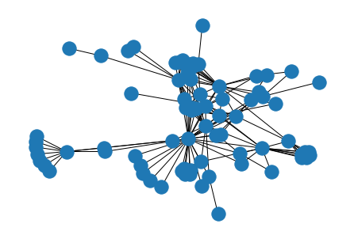
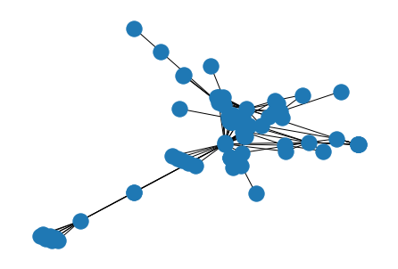

# グラフ描画におけるハイパーパラメータ最適化

## 尾上研究室 M1 高田楓我

---

# 今やってること

- グラフ描画に使うハイパーパラメータを最適化して、良い描画をつくる

---

# 良いグラフ描画のパラメータを決めるのは難しい

- 使用するデータに合わせてパラメータをチューニングする必要がある
- 経験的に決められたパラメータが良いパラメータかわかりづらい
- 大きいグラフはそもそも描画に時間がかかる

---

# 解決方法　最適化

- ハイパーパラメータ自動最適化フレームワークの[optuna](https://www.preferred.jp/ja/projects/optuna/)を使って最適化を行う
  - 説明変数にパラメータ、目的変数に複数の描画の定量評価を用いる

---

# 解決方法　評価指標

- angular resolution
- aspect ratio
- crossing angle maximization
- crossing number
- gabriel graph property
- ideal edge length
- node resolution
- shape based metrics
- stress

---

# 実験

- ハイパーパラメータ最適化を行った時の描画とパラメータをランダムに決めた描画はどちらがいい結果を出すのか？

## 実験方法

- 以下の方法で描画した際の評価指標の結果を比較する
  - optuna を用いてハイパーパラメータを試行回数 100 回行い、得られたパレート最適解のパラメータを用いて描画したときの評価
  - ランダムにパラメータを決めて描画する。それを上記の試行回数 100 回分繰り返し、評価

---

# 結果

| 評価指標                    | ランダム                                            | 最適化                                                |
| --------------------------- | --------------------------------------------------- | ----------------------------------------------------- |
| angular resolution          | 128.26950758864888                                  | 129.8325745328674   |
| aspect ratio                | 0.8462447222425235 | 0.7993395799456945                                    |
| crossing angle maximization | 156.51210422358085 | 145.55448165008102                                    |
| crossing number             | 794.79                                              | 766.5853658536586   |
| gabriel graph property      | 146445.91248654298                                  | 121111.61370729165  |
| ideal edge length           | 374666.1930745407                                   | 254528.4663745134   |
| node resolution             | 20.459449624162538                                  | 24.948867901783053   |
| shape based metrics         | 0.28348556370950057                                 | 0.29134995330061414        |
| stress                      | 2084740057948.6855                                  | 1533375330638.7556 |

---

randomized

optimized

---

# 今後やること

- 小さいグラフで最適化したパラメータは大きいグラフに適用してもうまく機能するのか
  - 良いパラメータはグラフに依存しないことがわかるかもしれない
- 最適化と相性の良いパラメータの傾向や、評価指標の種類の探求
- 彫られたパレート最適解のうち、どのパラメータを用いるのか決める方法を探す
